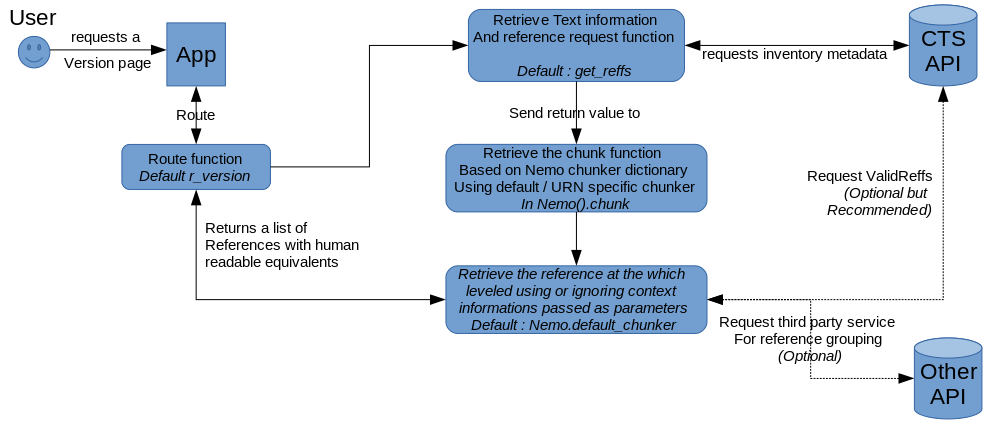

Chunkers, Transformers and GetPrevNext
======================================

Chunker, Transformers and GetPrevNext are way to customize your users' experience. Chunkers will decide what are the possible passages to see for a text, GetPrevNext what should be the previous and next passage while Transformers is a way to customize transformation, with or without XSLT

Process description
###################

.. topic:: User story

    A user browses available texts and select a text. He does not want a specific passages. Nemo proposes a list of passages based on the structure of the text.

    *Example*: The Epigrams of Martial are a group of many books, each containing hundreds of poems, which are themselves composed of up to 50 lines. The use would preferably be proposed the poem as the minimal citation scheme for browsing, rather than each line.

To propose passages to the user, Capitains Nemo uses a chunker function which will group, if needed, references together. The function is called upon returning the list of references to the view. The function should always return a list of references, and not full urn, with a human readable version of it, which can be the same.

.. _Nemo.chunker::

Chunkers
########

In the Nemo class, you'll find static methods called chunker, which can be used in the context of the
Nemo().chunker dictionary. Chunkers are used to take care of grouping references when a user arrives on
the version page of a text, to select where they should go.

Nemo contains multiple chunkers and accepts any contributions which provide helpful, transproject functions.

Defining a chunker in your Nemo implementation instance
#######################################################

The Nemo class accepts a chunker named argument that should be a dictionary where values are chunker functions.
This dictionary should at least contain one key named "default". Any other key should represents a URN and will override the default function if the requested version has the given urn.

.. code-block:: python

    from flask.ext.nemo import Nemo
    nemo = Nemo(chunker={
        "default": Nemo.default_chunker,
        "urn:cts:latinLit:phi1294.phi002.perseus-lat2": Nemo.scheme_chunker,
        # This will override the original function and provides a poem based reference for Martial Epigrammata in this version
        "urn:cts:latinLit:phi1017.phi004.opp-lat4": lambda version, callback: Nemo.line_chunker(version, callback, lines=50)
        # Use a lambda to override default line numbers returned by Nemo.line_chunker for Seneca's Medea
    })

.. note:: See :ref:`Nemo.api` documentation

Building your own : Structure, Parameters, Return Values
********************************************************

.. _Nemo.chunker.skeleton::

.. code-block:: python

    # Chunker skeleton
    def chunker_name(version, getValidReff):
        """ Document what your chunker should do

        :param version: A version object according to MyCapytains standards. It contains metadata about the citation scheme through version.citation
        :type version: MyCapytains.resources.inventory.Text
        :param getValidReff: Callback function to perform a getValidReff on the given param. It accepts a single parameter named "level" and returns a list of URNs
        :type getValidReff: function(level) -> [str]
        :return: A list of tuple of strings where the first element is the CTS URN reference part and the second a human readable version of it
        :rtype: [(str, str)]
        """
        return [("1.pr", "Book 1 Prolog")("1.1", "Book 1 Poem 1"), ...]

A chunker should take always at least two positional arguments :

- The first one will be the version, based on a MyCapytains.resources.inventory.Text class. It contains information about the citation scheme for example.
- The second one is a callback function that the chunker can use to retrieve the valid references. This callback itself takes a parameter named level. This callback corresponds to a MyCapytains.resources.texts.api.getValidReff() method. It returns a list of string based urns.

The chunker itself should return a list of tuples where the first element is a passage reference such as "1.pr" or "1-50" and a second value which is a readable version of this citation node.

.. note:: As seen in the diagram, there is no limitation for the chunker as long as it returns a valid list of references and their human readable version. It could in theory ask a third party service to return page-based urns to browse a text by pages according its OCR source / manuscript

.. code-block:: python

    # Example of chunker for the Satura of Juvenal
    def satura_chunker(version, getValidReff):
        reffs = [urn.split(":")[-1] for urn in getValidReff(level=2)]
        # Satura scheme contains three level (book, poem, lines) but only the Satura number is sequential
        # So as human readable, we give only the second member of the reference body
        return [(reff, "Satura {0}".format(reff.split(".")[-1])) for reff in reffs]1

Available chunkers
******************

.. automethod:: flask.ext.nemo.Nemo.default_chunker
.. automethod:: flask.ext.nemo.Nemo.line_chunker
.. automethod:: flask.ext.nemo.Nemo.scheme_chunker
.. automethod:: flask.ext.nemo.Nemo.level_chunker
.. automethod:: flask.ext.nemo.Nemo.level_grouper

PrevNext
########

PrevNext follows the same scheme as Chunker.

Transformers
############

Transformers should always return a string