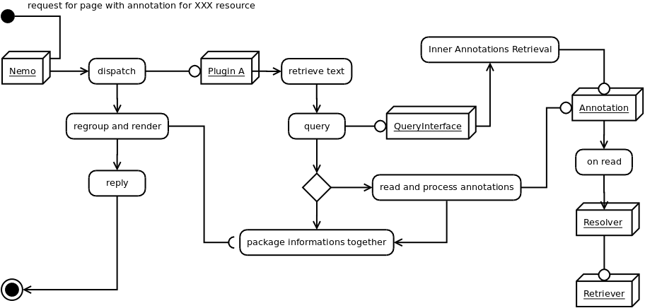
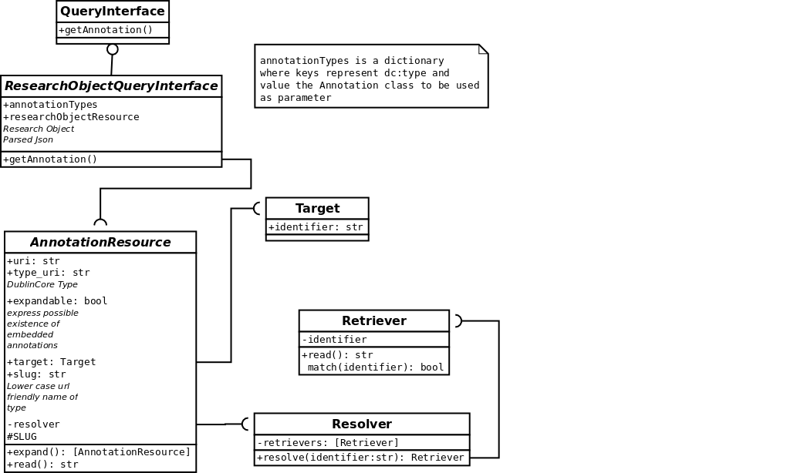

QueryInterface Design and Components Hierarchy
==============================================

Workflow of the components
##########################

.. _QueryInterfaceWorkflow:

This workflow illustrates how QueryInterface components works together

Description of the components
#############################

QueryInterface 
**************

is an object that given a URN retrieves annotations for it.

- Query interface should be fed with a function to retrieve valid references of the text
- It should have a .getAnnotation method which returns tuple where first element is a list of annotations and the second is the number of found resources
    - *urn  which takes a URN Object (MyCapytain)
    - `wildcard` as a boolean
        - `.` means exact match
        - `.%` means lower match matches
        - `%.` means higher match matches
        - `-` in range of 
        - `%.%` means not level dependant
    - `include, exclude` which would restrict the type of resources that can be retrieved using list of types
     - `limit` as a limit of number, default to None
     - `start` as the first parameter
     - `expand`

Annotations
***********

- Takes a resolver
- Has a read() method
- Has an .expandable properties which means the annotation might have embedded annotations
- Has an expand() methods which returns embedded annotations as a list

Resolver
********

- Decides on which retriever to use in a list of retrievers.
- Takes `retrievers=[]` as init argument
- Has a function resolve that takes an identifier argument
- Return a Retriever object

Retriever
*********

Retriever retrieves a resource given an identifier which can be cts, cite, local path, url, you name it.

- Has a `.match()` static method that returns True or False if the identifier can be retrieved by it
- Has a `.read()` method that returns the body of the resource 