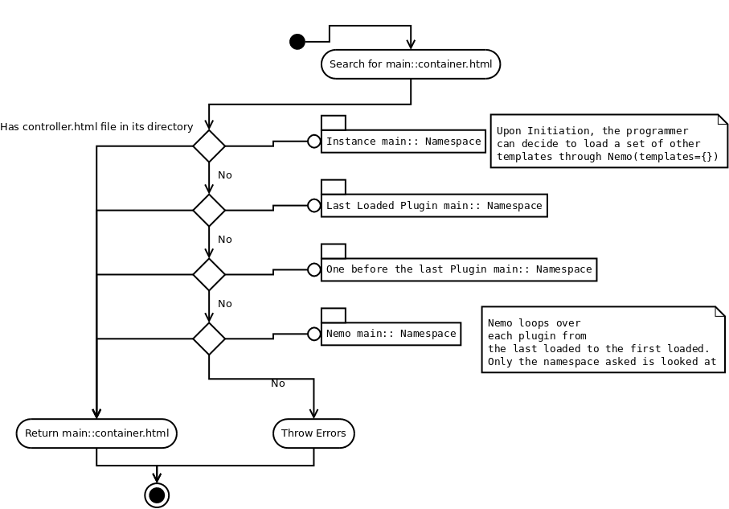

Templates documentation
=======================

.. _Templates.documentation::

Templates
#########

Namespaces
**********

Nemo templates are namespaced since 1.0.0 and the plugin system. Nemo base plugins are in the namespace "main", the prefix used in Nemo being "::". For any new template added to Nemo using the original container, it would probably be designed with 

.. code-block:: html

    

    
    Add the HTML here
    

Add and change templates
************************ 

You can add namespace to Nemo by using the templates parameter on initiation, but it can also be used to overwrite templates. For example, given a directory `./templates/main` with a file `container.html`, the following code snippet would write over Nemo original container.html

.. code-block:: python
    
    nemo = Nemo(templates={
        "main": "./templates/main"
    })

.. note:: It is recommended to split namespaced templates in different folders when adding templates to the Nemo instance.

.. warning:: If two declared namespaces share the same directory, there is risk of collision between templates names and thus overwriting potential. For example, if ``main::`` and ``plugin_1::`` point to ``dir1``,  ``main::file.html`` and `plugin_1::file.html` are the same.

Template choice behaviour in Nemo
*********************************

.. _templateOrder:

Nemo Default Templates
######################

The following tables gives informations about the variables sent to each templates.

Variables shared across templates
*********************************

+-----------------+----------------------------------------------------------+
| Variable Name   | Details                                                  |
+=================+==========================================================+
| `assets['css']` | List of css files to link to.                            |
+-----------------+----------------------------------------------------------+
| `assets['js']`  | List of js files to link to.                             |
+-----------------+----------------------------------------------------------+
| `url[*]`        | Dictionary where keys and values are derived from routes |
+-----------------+----------------------------------------------------------+
| `templates[*]`  | Dictionary of templates with at least menu and container |
+-----------------+----------------------------------------------------------+
| `collections`   | Collections list                                         |
+-----------------+----------------------------------------------------------+
| `lang`          | Lang to display                                          |
+-----------------+----------------------------------------------------------+

main::index.html
****************

Only `Variables shared across templates`_

main::menu.html
***************

Only `Variables shared across templates`_

main::breadcrumb.html
***************

Only `Variables shared across templates`_

main::textgroups.html
*********************

See `r_collection` in :ref:`Nemo.api.r_collection`

+-----------------+----------------------------------------------------------+
| Variable Name   | Details                                                  |
+=================+==========================================================+
| `textgroups`    | List of textgroups according to a collection             |
+-----------------+----------------------------------------------------------+

main::texts.html
****************

main::See `r_texts` in :ref:`Nemo.api.r_texts`

+-----------------+----------------------------------------------------------+
| Variable Name   | Details                                                  |
+=================+==========================================================+
| `texts`         | List of texts according to a textgroup                   |
+-----------------+----------------------------------------------------------+

main::version.html
******************

See `r_version` in :ref:`Nemo.api.r_version`

+-----------------+-----------------------------------------------------------------------------------------+
| Variable Name   | Details                                                                                 |
+=================+=========================================================================================+
| `version`       | Version object with metadata about current text                                         |
+-----------------+-----------------------------------------------------------------------------------------+
| `reffs`         | List of tuples where first element is a reference, second a human readable translation  |
+-----------------+-----------------------------------------------------------------------------------------+

main::text.html
***************

See `r_passage` in :ref:`Nemo.api.r_passage`

+-----------------+----------------------------------------------------------------------------------------+
| Variable Name   | Details                                                                                |
+=================+========================================================================================+
| `version`       | Version object with metadata about current text                                        |
+-----------------+----------------------------------------------------------------------------------------+
| `text_passage`  | Markup object representing the text                                                    |
+-----------------+----------------------------------------------------------------------------------------+
| `urn`  | Markup object containing the URN of the passage for display
+-----------------+----------------------------------------------------------------------------------------+
| `prev`          | Previous Passage Reference                                                             |
+-----------------+----------------------------------------------------------------------------------------+
| `next`          | Following Passage Reference                                                            |
+-----------------+----------------------------------------------------------------------------------------+

main::passage_footer.html
***************

See `r_passage` in :ref:`Nemo.api.r_passage`

+-----------------+----------------------------------------------------------------------------------------+
| Variable Name   | Details                                                                                |
+=================+========================================================================================+
| `version`       | Version object with metadata about current text                                        |
+-----------------+----------------------------------------------------------------------------------------+
| `text_passage`  | Markup object representing the text                                                    |
+-----------------+----------------------------------------------------------------------------------------+
| `urn`  | Markup object containing the URN of the passage for display
+-----------------+----------------------------------------------------------------------------------------+
| `prev`          | Previous Passage Reference                                                             |
+-----------------+----------------------------------------------------------------------------------------+

